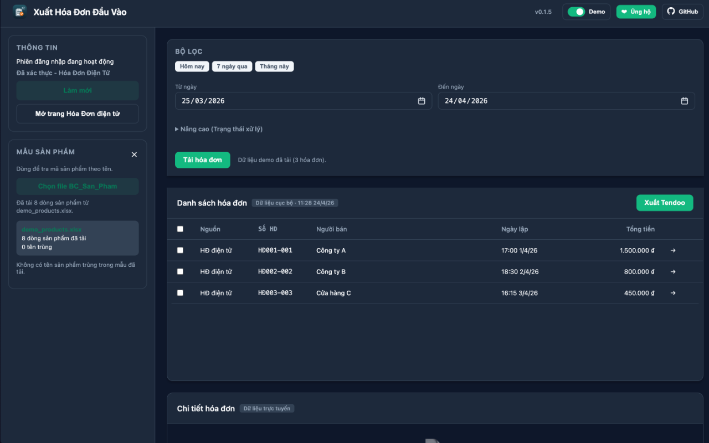
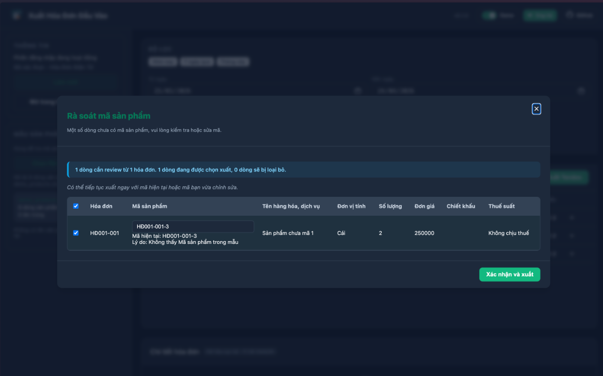
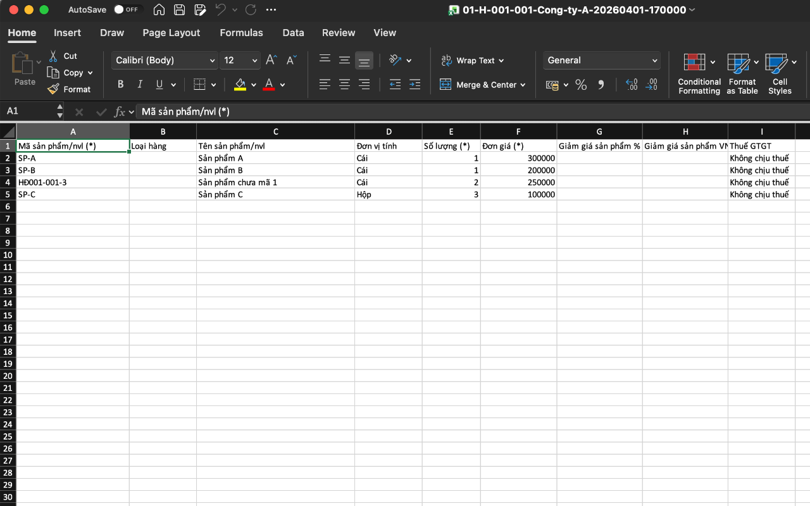

# Xuất Hóa Đơn Đầu Vào (MVP)

## Tổng quan

Tiện ích "Xuất Hóa Đơn Đầu Vào" giúp kế toán và người dùng nhanh chóng tổng hợp, kiểm tra và xuất hóa đơn mua vào từ cổng Hóa đơn điện tử của Tổng cục Thuế.

**CHỨC NĂNG CHÍNH:**

- Kiểm tra phiên đăng nhập (session) trên trình duyệt và sử dụng phiên hiện có để tải dữ liệu; nếu chưa đăng nhập sẽ mở trang đăng nhập để người dùng xác thực.
- Tải và gộp dữ liệu mua vào từ hai nguồn, hiển thị danh sách gộp rõ ràng.
- Lọc theo khoảng ngày, tìm kiếm và phân biệt nguồn dữ liệu bằng badge.
- Mở chi tiết từng hóa đơn, xem line items khi có, và rà soát thông tin trước khi xuất.
- Hỗ trợ rà soát mã sản phẩm theo mẫu BC_San_Pham để phát hiện trùng hoặc thiếu mã.
- Xuất dữ liệu sang file .xlsx tương thích mẫu nhập kho hóa đơn GTGT của Tendoo và cho phép tải về ngay trên máy người dùng.
- Hoạt động giới hạn trong phạm vi cổng Hóa đơn điện tử; không có đồng bộ hóa tự động sang dịch vụ bên ngoài.

**CÁCH HOẠT ĐỘNG:**

Khi mở tiện ích, nó sẽ cố gắng sử dụng session trình duyệt để truy vấn dữ liệu; nếu không có phiên hợp lệ, tiện ích sẽ chuyển bạn đến trang đăng nhập của cổng để xác thực, sau đó quay lại giao diện để tải và gộp hóa đơn.

**QUYỀN RIÊNG TƯ:**

- Dữ liệu tài khoản/phiên: Tiện ích chỉ sử dụng session (phiên) đã có trên trình duyệt để truy cập cổng; không thu thập hay gửi thông tin đăng nhập ra ngoài.
- Dữ liệu hóa đơn: Toàn bộ dữ liệu hóa đơn được tải và xử lý trên máy người dùng; các tệp `.xlsx` được tạo và tải xuống thiết bị của bạn, không được upload tự động sang dịch vụ bên thứ ba.
- Lưu trữ cục bộ: `storage` chỉ dùng để lưu cache, trạng thái giao diện và cấu hình mẫu sản phẩm; không lưu mật khẩu hoặc dữ liệu nhạy cảm.
- Quyền hạn: Tiện ích chỉ yêu cầu các quyền cần thiết (ví dụ: `storage`, `downloads`, `tabs`, `scripting` và host permission cho `hoadondientu.gdt.gov.vn`).
- Hỗ trợ: Nếu cần trợ giúp, liên hệ qua email hỗ trợ được cung cấp trong phần liên hệ.

Mục tiêu là giúp bạn tiết kiệm thời gian khi tổng hợp và xuất hóa đơn mua vào, đồng thời giữ an toàn cho dữ liệu và quyền riêng tư của bạn.





## Phạm vi hiện tại

* Luồng đăng nhập hybrid:
  * Nếu người dùng đã đăng nhập tại `https://hoadondientu.gdt.gov.vn/`, extension tái sử dụng session hiện có.
  * Nếu chưa đăng nhập, extension mở một cửa sổ đăng nhập riêng để người dùng xác thực trước.
* Nút hành động của extension mở giao diện toàn trang thay vì popup nhỏ.
* Bộ lọc ngày từ - đến.
* Tải và gộp 2 nguồn hóa đơn mua vào:
  * `/query/invoices/purchase`
  * `/sco-query/invoices/purchase`
* Danh sách hóa đơn gộp, xem chi tiết từng hóa đơn, chọn nhiều.
* Xuất từng hóa đơn đã chọn ra file `.xlsx` với header tương thích Tendoo.

## Cách cài đặt và kích hoạt extension

Extension hiện có 3 cách để tải và cài đặt: cài trực tiếp từ **Chrome Web Store**, clone project về máy, hoặc tải bản release được tạo từ workflow trên GitHub.

### Cách 1: Cài từ Chrome Web Store

1. Mở Chrome và truy cập trang tiện ích chính thức:

  https://chromewebstore.google.com/detail/bjfejbopdhigplifbjibfiejacbbgmkc

1. Nhấn **Thêm vào Chrome** (Add to Chrome) và xác nhận quyền yêu cầu.
2. Sau khi cài, mở menu `chrome://extensions` để ghim hoặc quản lý tiện ích.
3. Mở extension từ thanh công cụ để bắt đầu sử dụng.

### Cách 2: Tải từ GitHub Release

1. Vào trang Releases của repository trên GitHub.
2. Tải file release `.zip` do workflow tạo ra.
3. Giải nén file `.zip` ra một thư mục trên máy.
4. Mở Chrome và vào `chrome://extensions`.
5. Bật chế độ Nhà phát triển (Developer mode).
6. Chọn `Load unpacked`.
7. Trỏ tới thư mục đã giải nén, tức thư mục chứa file `manifest.json`.

### Cách 3: Clone project về máy (phát triển)

1. Clone repository về máy.
2. Mở terminal tại thư mục `hoadon/`.
3. Cài dependencies Node.js bằng lệnh:

```bash
npm install
```

Bước này sẽ tạo thư mục `node_modules/` để đồng bộ môi trường phát triển.

4. Mở Chrome và vào `chrome://extensions`.
5. Bật chế độ Nhà phát triển (Developer mode).
6. Chọn `Load unpacked`.
7. Trỏ tới thư mục `hoadon/` vừa clone, tức thư mục có file `manifest.json`.


## Ghi chú

* MVP này xuất trực tiếp `.xlsx` mà không cần workbook mẫu Tendoo đi kèm.
* API được gọi với `credentials: include`, nên người dùng cần đăng nhập trên cổng Hóa đơn điện tử chính thức trước.
* Nếu cài từ source để phát triển tiếp, hãy chạy lại `npm install` sau khi clone nếu `node_modules/` chưa tồn tại.
* Extension đã được phát hành trên Chrome Web Store: https://chromewebstore.google.com/detail/bjfejbopdhigplifbjibfiejacbbgmkc

